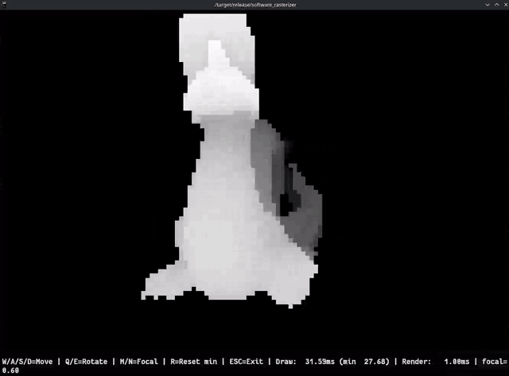

# ttyraster



Renders OBJ meshes in the terminal on the CPU. Each frame is built as a string of ANSI escape codes and written to stdout. Pixels are shaded by depth, so nearer surfaces are brighter. The `▄` half-block character packs two pixels into each terminal cell.

## Running

```
cargo run --release
```

You need a terminal that supports 24-bit color. Debug builds are noticeably slower on the larger models.

The model path is hardcoded in `src/main.rs`, and `models/` is gitignored, so you'll need to point it at your own `.obj` file before it does anything. The loader only reads `v` and `f` lines and expects triangulated faces.

## Controls

| Key | Action |
|---|---|
| W / S | Move forward / back |
| A / D | Strafe left / right |
| Q / E | Rotate camera around Y |
| M / N | Increase / decrease focal length |
| R | Reset the min draw-time counter |
| Esc | Quit |

Timing stats are printed on the last line.

## Files

`main.rs` has the frame loop and input handling. `screen.rs` owns the pixel and depth buffers, fills triangles using edge functions, and writes the frame out. `camera.rs` does the view transform and perspective projection. `triangle.rs` clips against the near plane. `object.rs` parses OBJ. `vectors.rs` and `quaternion.rs` are the math.

Depends on crossterm and anyhow.
